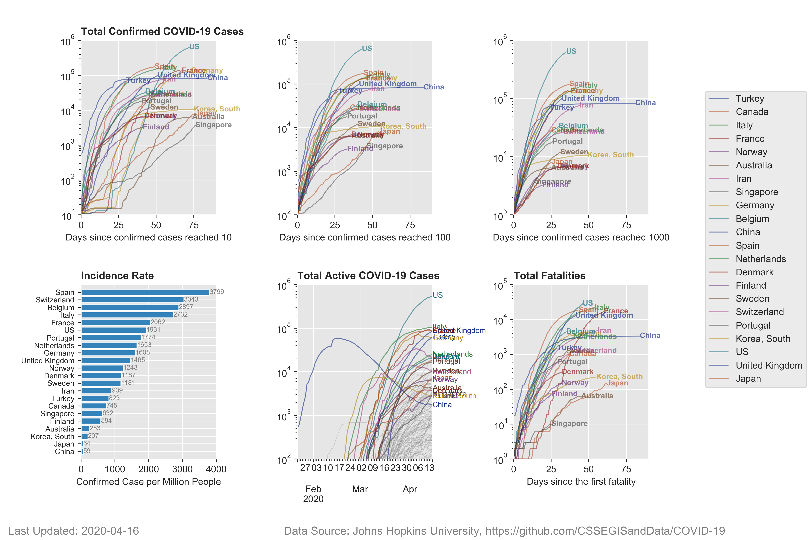

# covid19-data-visualization

 Visualize COVID-19 reported data. Visuals can be updated as new data are generated and updated.
 
 Data is from Johns Hopkins CSSE
 
 https://github.com/CSSEGISandData/COVID-19
 
 ## Total Confirmed COVID-19 Cases
 
 Log-y axis shows total confirmed cases. X-axis is days since confirmed cases reached 100.

 

 ## Total Confirmed COVID-19 Cases: Countries vs Italy
 
 Log-y axis shows total confirmed cases. X-axis is days since confirmed cases reached 100. Comparison to Italy.

 

 ## Case Plots
 
 Series of plots monitoring COVID-19

 
